# AWS AI Services
## Visual, Exam-Focused Reference for Every AWS AI Service Covered

  
  
  

> Use this page when a practice question asks: “Which AWS service should you choose?”
> The exam often tests service selection, managed-vs-custom tradeoffs, security controls, cost optimization, and how services combine into AI architectures.

---

## 1. One-Screen Mental Map

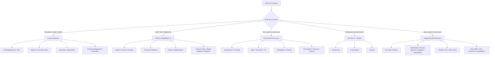

---

## 2. Fast Lookup Table

| If the question says... | Think first | Why |
|---|---|---|
| Foundation model, LLM, text generation, summarization | Amazon Bedrock | Managed access to foundation models without managing infrastructure |
| RAG, Q&A over documents, vector search with generated answers | Bedrock Knowledge Bases | Managed ingestion, embeddings, retrieval, and Bedrock generation |
| AI agent, action groups, multi-step task automation | Bedrock Agents | Managed orchestration for tool/API use |
| Block harmful outputs, detect PII, safety policies | Bedrock Guardrails | Central guardrail policies for GenAI apps |
| Enterprise AI assistant over company knowledge | Amazon Q Business | Managed business assistant with enterprise data connectors |
| Coding assistant, explain code, generate tests | Amazon Q Developer | AI assistant for developers and AWS builders |
| Custom ML model, train/deploy/monitor | Amazon SageMaker AI | Full ML lifecycle platform |
| No-code ML for business users | SageMaker Canvas | Visual ML without writing code |
| Automatically build ML model from tabular data | SageMaker Autopilot | AutoML for model selection and training |
| Bias/explainability | SageMaker Clarify | Bias detection and explainability reports |
| Model drift in production | SageMaker Model Monitor | Monitors data quality, model quality, bias, and drift |
| Sentiment, entities, key phrases, language detection | Amazon Comprehend | Pre-trained NLP service |
| Medical entities from clinical text | Amazon Comprehend Medical | Healthcare-specific NLP |
| Translate text | Amazon Translate | Neural machine translation |
| Text-to-speech | Amazon Polly | Converts text into lifelike speech |
| Speech-to-text | Amazon Transcribe | Converts audio to text |
| Medical dictation/transcription | Amazon Transcribe Medical | Healthcare speech recognition |
| Chatbot or voice bot | Amazon Lex | Conversational interfaces using ASR + NLU |
| Image/video object, label, face, moderation detection | Amazon Rekognition | Computer vision API |
| Extract text, forms, tables from documents | Amazon Textract | OCR plus structured document extraction |
| Personalized recommendations | Amazon Personalize | Managed recommendations engine |
| Time-series forecasting | Amazon Forecast | Demand, inventory, and metric forecasting |
| Business metric anomaly detection | Amazon Lookout for Metrics | Detects anomalies in KPIs and metrics |
| Visual anomaly detection in manufacturing | Amazon Lookout for Vision | Defect/anomaly detection from images |
| Equipment anomaly detection | Amazon Lookout for Equipment | Industrial equipment predictive maintenance |
| Human review of ML predictions | Amazon Augmented AI (A2I) | Human-in-the-loop review workflows |
| Enterprise search over internal docs | Amazon Kendra | ML-powered semantic enterprise search |
| Vector DB for RAG | Amazon OpenSearch Service | Search, hybrid search, vector search |
| Store training data, documents, logs | Amazon S3 | Durable object storage/data lake foundation |
| Audit logs | AWS CloudTrail | Records API activity for governance/compliance |
| Metrics, logs, alarms | Amazon CloudWatch | Observability for AI apps and ML workloads |
| Encryption keys | AWS KMS | Key management for encryption |
| Identity and access | AWS IAM | Permissions and least privilege |
| Private networking | Amazon VPC / AWS PrivateLink | Network isolation and private service access |
| Sensitive data discovery | Amazon Macie | Finds sensitive data such as PII in S3 |
| Compliance reports | AWS Artifact | Access AWS compliance documentation |
| Automated audit evidence | AWS Audit Manager | Collects evidence for audits |
| Vulnerability scanning | Amazon Inspector | Finds software/package vulnerabilities |
| Cost tracking and alerts | Cost Explorer / AWS Budgets | Cost analysis and budget guardrails |

---

## 3. Generative AI and Foundation Model Services

### Amazon Bedrock

| Attribute | Details |
|---|---|
| Category | Fully managed foundation model service |
| Use when | You need LLMs or multimodal FMs without provisioning servers |
| Core capabilities | Text generation, chat, summarization, classification, embeddings, image generation, model customization, evaluation |
| Exam phrase | “Use foundation models without managing infrastructure” |

Amazon Bedrock is the central AWS service for generative AI on the exam. It gives API access to foundation models from Amazon and third-party providers. You select a model, send prompts through APIs such as Converse, and pay based on usage or provisioned throughput.

Key things to remember:

- Bedrock is managed: no servers, no model-hosting infrastructure, no patching.
- It supports multiple model families, so you choose the best model for cost, latency, quality, and modality.
- It supports customization patterns such as fine-tuning and continued pre-training for supported models.
- It integrates with Knowledge Bases, Agents, Guardrails, IAM, CloudTrail, CloudWatch, KMS, and VPC endpoints.

Best fit:

- Chatbots
- Content generation
- Summarization
- Document analysis
- Retrieval augmented generation
- Code generation support
- Multimodal GenAI workloads

Avoid choosing Bedrock when:

- The question requires building a completely custom ML algorithm from scratch.
- The workload needs low-level control over training infrastructure.
- The answer is a narrow pre-trained task already covered by Comprehend, Polly, Rekognition, Textract, or Translate.

#### Bedrock model access pattern

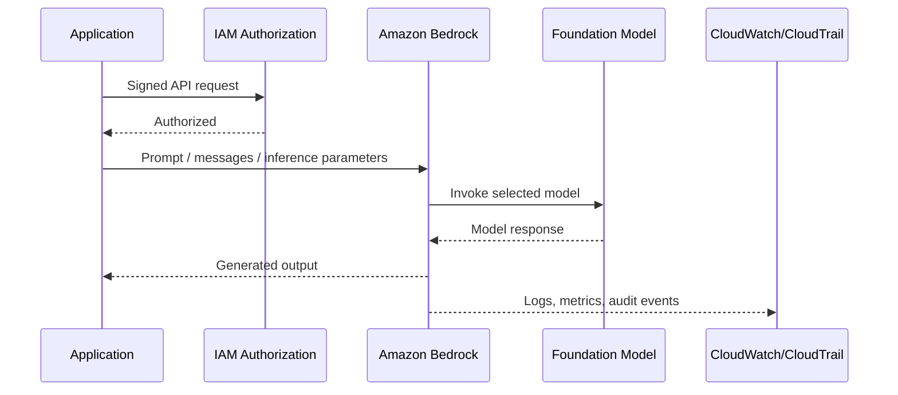

### Amazon Bedrock Knowledge Bases

| Attribute | Details |
|---|---|
| Category | Managed RAG service |
| Use when | You need Q&A over private documents |
| Core capabilities | Data source ingestion, chunking, embeddings, vector retrieval, citations, generation through Bedrock |
| Exam phrase | “Managed retrieval augmented generation over enterprise documents” |

Bedrock Knowledge Bases helps you build RAG applications without designing the full ingestion and retrieval stack yourself. Documents can be stored in data sources such as Amazon S3. The service chunks content, creates embeddings, stores/retrieves vectors using supported vector stores, and combines retrieved context with a foundation model.

Best fit:

- Customer support knowledge base
- Internal policy assistant
- Product documentation Q&A
- Legal, HR, or compliance document lookup

Architecture:

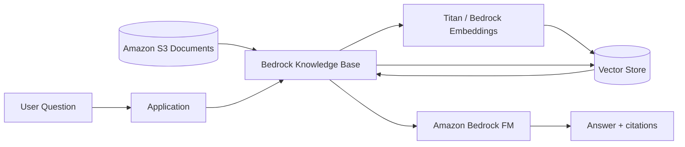

Exam traps:

- If the question says “quickly build Q&A over documents,” Knowledge Bases is usually better than custom OpenSearch + Lambda.
- If the question says “full control over retrieval logic,” custom RAG with Bedrock + OpenSearch may be better.
- If the question says “enterprise search without generation,” Amazon Kendra may be the better answer.

### Amazon Bedrock Agents

| Attribute | Details |
|---|---|
| Category | Managed AI agent framework |
| Use when | A GenAI app must take actions or complete multi-step workflows |
| Core capabilities | Task planning, action groups, Lambda/API calls, knowledge base integration, orchestration |
| Exam phrase | “Agent that can reason, retrieve information, and invoke actions” |

Bedrock Agents let a foundation model break a user request into steps and call tools or APIs. An action group usually maps to AWS Lambda or an API schema. Agents can also use Knowledge Bases for grounding.

Best fit:

- “Book an appointment” assistant
- IT helpdesk automation
- Order status + cancellation bot
- Insurance quote workflow
- Multi-step business process assistant

Typical flow:

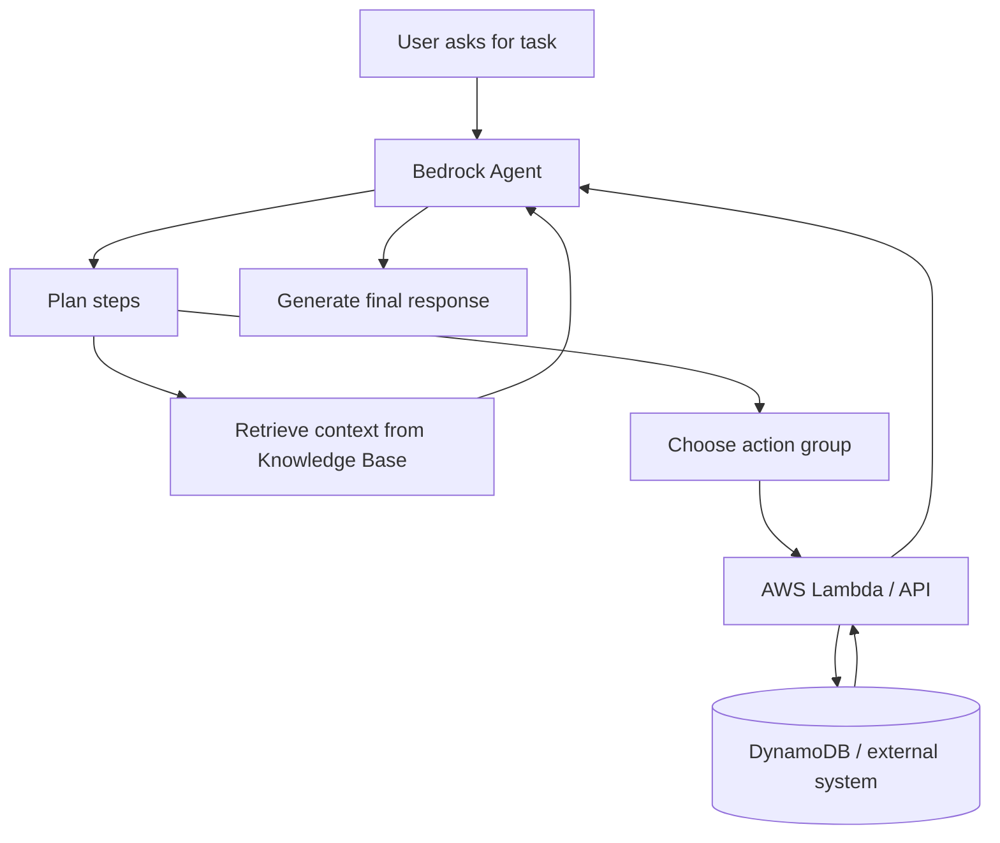

### Amazon Bedrock Guardrails

| Attribute | Details |
|---|---|
| Category | Responsible AI and safety control |
| Use when | You must filter unsafe prompts or outputs |
| Core capabilities | Content filters, denied topics, word filters, sensitive information filters, PII redaction/blocking |
| Exam phrase | “Apply safety policies consistently across GenAI applications” |

Guardrails are used to reduce harmful, inappropriate, or policy-violating GenAI behavior. They can be applied to inputs and outputs.

Use Guardrails for:

- Blocking harmful content
- Preventing certain topics
- Redacting or blocking sensitive information
- Enforcing application-specific safety rules
- Creating consistent safety boundaries across models

Do not confuse with:

- IAM: controls who can access AWS resources.
- KMS: encrypts data.
- CloudTrail: records API activity.
- SageMaker Clarify: evaluates bias/explainability for ML models.

### Amazon Bedrock Model Evaluation

Use Bedrock model evaluation when you need to compare foundation models or prompts based on quality, safety, cost, latency, or task-specific metrics.

Important exam idea:

- Choose smaller/faster/cheaper models for simple tasks.
- Choose larger/higher-quality models for complex reasoning, critical decisions, or strict accuracy requirements.
- Evaluate with representative business data, not just generic prompts.

### Amazon Bedrock Prompt Management

Prompt Management helps store, version, and manage prompts. It is useful when teams need repeatable prompt templates and controlled prompt updates.

Use when:

- Prompt changes need version control.
- Multiple apps share prompt templates.
- You need safer rollout of prompt changes.

### Amazon Bedrock AgentCore

AgentCore is associated with securely deploying and operating agents, including identity, runtime, tool access, memory, and policy-style controls for agentic workloads.

Exam memory:

- Bedrock Agents = build and orchestrate agent behavior.
- AgentCore = operate/manage agent runtime, identity, memory, and tool access patterns.

### Amazon Nova

Amazon Nova is Amazon’s family of foundation models for text, image, and multimodal use cases. For the exam, treat Nova as an Amazon FM option available through Bedrock for generative AI workloads.

Use cases:

- Text generation
- Multimodal understanding
- Image generation with Nova Canvas
- Video generation with Nova Reel, where available

### Amazon Titan Embeddings

Titan Embeddings convert text into numeric vectors that capture semantic meaning. They are commonly used in RAG, semantic search, clustering, and recommendations.

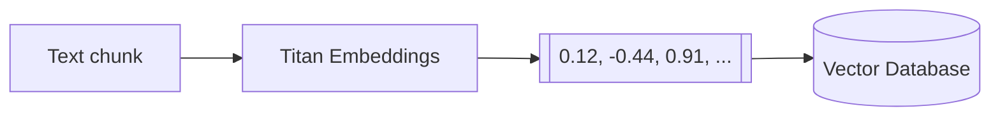

---

## 4. Amazon Q Services

### Amazon Q Business

| Attribute | Details |
|---|---|
| Category | Enterprise GenAI assistant |
| Use when | Employees need answers and help from company data |
| Core capabilities | Enterprise connectors, permissions-aware responses, business Q&A, task assistance |
| Exam phrase | “AI assistant for enterprise knowledge workers” |

Amazon Q Business is a managed assistant for internal business users. It connects to enterprise data sources and answers questions based on organizational content while respecting permissions.

Best fit:

- Company policy assistant
- HR and IT helpdesk assistant
- Internal knowledge discovery
- Employee productivity assistant

Do not confuse with:

- Amazon Q Developer: for software development and AWS coding help.
- Bedrock: lower-level foundation model platform for building custom GenAI apps.
- Kendra: enterprise search; it retrieves/searches but is not the same as a full assistant.

### Amazon Q Developer

| Attribute | Details |
|---|---|
| Category | AI coding and AWS development assistant |
| Use when | Developers need code suggestions, explanations, debugging, AWS guidance |
| Core capabilities | Code generation, code explanation, test generation, security suggestions, AWS console/IDE assistance |
| Exam phrase | “AI assistant for developers” |

Use Q Developer for developer productivity, not general business knowledge work.

---

## 5. Machine Learning Platform: Amazon SageMaker AI

### Amazon SageMaker AI

| Attribute | Details |
|---|---|
| Category | End-to-end ML platform |
| Use when | You need to build, train, tune, deploy, and monitor custom ML models |
| Core capabilities | Notebooks/Studio, training jobs, endpoints, pipelines, feature store, model registry, monitoring |
| Exam phrase | “Custom ML lifecycle on AWS” |

SageMaker is the main AWS platform for traditional ML and custom model workflows. Compared with Bedrock, SageMaker gives more control but requires more ML and operational expertise.

Choose SageMaker when:

- You need a custom model for a specific dataset.
- You need control over algorithms, training jobs, containers, or endpoints.
- You need MLOps: pipelines, model registry, experiments, monitoring.
- You are deploying non-foundation-model ML workloads.

Choose Bedrock instead when:

- You want managed access to existing foundation models.
- You do not need to train or host your own model.
- The fastest path to a GenAI app matters.

#### SageMaker lifecycle

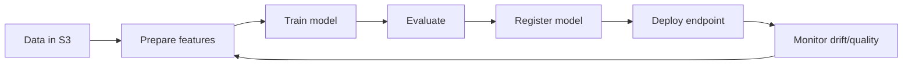

### SageMaker Studio

SageMaker Studio is an integrated development environment for ML. Use it for notebooks, experiments, data preparation, model training, and collaboration.

Exam memory:

- Studio = ML IDE/workbench.
- SageMaker = broader platform.

### SageMaker Canvas

Canvas is no-code ML for business analysts. Users can create predictions from data without writing code.

Best fit:

- Business user wants prediction from spreadsheet-style data.
- No ML engineering team is available.
- Fast prototype is more important than deep customization.

### SageMaker Autopilot

Autopilot is AutoML. It automatically explores algorithms, preprocessing, and model candidates for tabular ML problems.

Use when:

- You want automated model building.
- You still want visibility into candidate models.
- The question says “automatically select and train the best model.”

### SageMaker JumpStart

JumpStart is a model hub and solution template catalog. It helps discover, deploy, and fine-tune pre-trained models and reference solutions.

Use when:

- You want to start from a pre-trained model.
- You need example notebooks or templates.
- You want faster experimentation in SageMaker.

### SageMaker Experiments

Experiments tracks and compares training runs, parameters, metrics, and artifacts.

Exam phrase:

- “Track and compare model experiments.”

### SageMaker Feature Store

Feature Store stores, shares, and reuses ML features. It supports consistency between training and inference.

Use when:

- Multiple models use the same features.
- You need online and offline feature access.
- You want to reduce duplicated feature engineering.

### SageMaker Model Registry

Model Registry manages model versions and approval states before deployment.

Use when:

- You need model governance.
- You need versioning and approval workflows.
- You need to know which model version is in production.

### SageMaker Pipelines

Pipelines orchestrates ML workflows: processing, training, evaluation, registration, and deployment steps.

Use when:

- You need repeatable MLOps workflows.
- You need automated retraining/deployment pipelines.

### SageMaker Model Monitor

Model Monitor detects production issues such as data drift, model quality degradation, bias drift, and feature attribution drift.

Use when:

- Production model behavior may change over time.
- You need alerts when input data distribution changes.
- You need ongoing model observability.

### SageMaker Clarify

Clarify helps detect bias and explain model predictions.

Use when:

- The question mentions fairness, bias, explainability, or feature importance.
- You need responsible AI analysis for ML models.

Do not confuse with Bedrock Guardrails:

| Need | Service |
|---|---|
| Filter harmful GenAI prompts/outputs | Bedrock Guardrails |
| Detect bias/explain ML predictions | SageMaker Clarify |

### Amazon Augmented AI (A2I)

A2I adds human review workflows to ML predictions.

Use when:

- Decisions are high risk.
- Confidence is low.
- Regulations or business policy require human review.
- Medical, financial, or legal outcomes require oversight.

---

## 6. Pre-Trained Text and Language AI Services

### Amazon Comprehend

| Attribute | Details |
|---|---|
| Category | Natural language processing |
| Use when | You need text analysis without training your own NLP model |
| Core capabilities | Sentiment, entities, key phrases, language detection, topic modeling, classification |
| Exam phrase | “Extract insights and relationships from text” |

Best fit:

- Detect customer sentiment in reviews.
- Extract names, places, dates, and organizations.
- Classify support tickets.
- Find key phrases in documents.

### Amazon Comprehend Medical

Comprehend Medical extracts healthcare entities and relationships from clinical text.

Use when:

- Medical notes mention medications, conditions, dosages, procedures, anatomy.
- The question is healthcare-specific and text-based.

### Amazon Translate

Translate is neural machine translation.

Use when:

- Translate documents, chat messages, support tickets, or web content.
- The question asks for multilingual text conversion.

### Amazon Polly

Polly converts text to speech.

Use when:

- Voice prompts
- Audiobooks
- Accessibility narration
- Contact center audio
- IVR systems

### Amazon Transcribe

Transcribe converts speech to text.

Use when:

- Meeting transcription
- Call center analytics
- Video captions
- Audio search

### Amazon Transcribe Medical

Transcribe Medical converts clinical speech into medical text.

Use when:

- Doctor-patient conversations
- Clinical dictation
- Healthcare documentation

### Amazon Lex

Lex builds conversational chatbots and voice bots using automatic speech recognition and natural language understanding.

Use when:

- You need intents, slots, and dialog flows.
- You are building a chatbot or voice assistant.
- The bot is structured and task-oriented.

Compare:

| Requirement | Best service |
|---|---|
| Structured chatbot with intents/slots | Amazon Lex |
| GenAI chatbot with reasoning and grounding | Bedrock Agents or Bedrock + Knowledge Bases |
| Enterprise assistant over company data | Amazon Q Business |

---

## 7. Vision and Document AI Services

### Amazon Rekognition

| Attribute | Details |
|---|---|
| Category | Image and video analysis |
| Use when | You need pre-trained computer vision APIs |
| Core capabilities | Labels, objects, faces, moderation, text in image, celebrities, video analysis |
| Exam phrase | “Analyze images and videos” |

Best fit:

- Detect objects in images.
- Moderate unsafe images.
- Identify faces where appropriate and compliant.
- Analyze stored or streaming video.

### Amazon Rekognition Custom Labels

Custom Labels trains custom image classification/object detection models with your labeled images.

Use when:

- Generic Rekognition labels are not enough.
- You need domain-specific visual classes, such as a specific product defect.

### Amazon Textract

| Attribute | Details |
|---|---|
| Category | Document AI / OCR |
| Use when | You need structured data from documents |
| Core capabilities | Printed text, handwriting, forms, key-value pairs, tables |
| Exam phrase | “Extract text, forms, and tables from scanned documents” |

Best fit:

- Invoices
- Receipts
- Loan forms
- Tax documents
- Insurance claims

Do not confuse:

- Rekognition = understand image/video content.
- Textract = extract document text and structure.

### Amazon Lookout for Vision

Lookout for Vision detects visual defects and anomalies, usually in industrial/manufacturing settings.

Use when:

- Manufacturing quality control
- Product defect detection
- Visual inspection automation

---

## 8. Forecasting, Recommendations, and Anomaly Detection

### Amazon Personalize

Personalize creates recommendation systems based on user behavior and item data.

Use when:

- “Customers who viewed this also viewed...”
- Personalized product ranking
- Content recommendations
- User-specific marketing recommendations

### Amazon Forecast

Forecast provides time-series forecasting.

Use when:

- Demand planning
- Inventory forecasting
- Revenue forecasting
- Staffing forecasts
- Resource usage forecasts

Exam memory:

- Forecast predicts future numeric values over time.
- Personalize recommends items to users.

### Amazon Lookout for Metrics

Lookout for Metrics detects anomalies in business and operational metrics.

Use when:

- Revenue suddenly drops.
- Conversion rate spikes unexpectedly.
- Website traffic deviates from normal patterns.
- Business KPI anomalies need alerts.

### Amazon Lookout for Equipment

Lookout for Equipment detects abnormal equipment behavior from sensor data.

Use when:

- Predictive maintenance
- Industrial IoT telemetry
- Detecting machine failure patterns

---

## 9. Healthcare AI Services

### AWS HealthScribe

HealthScribe helps generate clinical documentation from patient-clinician conversations.

Use when:

- The question mentions clinical notes from conversations.
- The output is documentation for healthcare workflows.

### Healthcare service distinction

| Scenario | Service |
|---|---|
| Medical speech-to-text | Amazon Transcribe Medical |
| Extract medical entities from clinical text | Amazon Comprehend Medical |
| Generate clinical documentation from conversations | AWS HealthScribe |

---

## 10. Search, Vector, Graph, and RAG Data Stores

### Amazon Kendra

Kendra is intelligent enterprise search.

Use when:

- You need search over internal documents.
- You need semantic search and relevance ranking.
- You need connectors to enterprise repositories.

Compare with Bedrock Knowledge Bases:

| Requirement | Better fit |
|---|---|
| Search documents and return ranked results | Amazon Kendra |
| Generate answers grounded in retrieved documents | Bedrock Knowledge Bases |
| Fully custom retrieval pipeline | OpenSearch + Bedrock + Lambda |

### Amazon OpenSearch Service

OpenSearch supports full-text search, log analytics, and vector search. In AI architectures, it is commonly used as a vector store for RAG and semantic search.

Use when:

- You need hybrid keyword + vector search.
- You need custom RAG retrieval behavior.
- You want control over index design and query logic.

### Amazon Aurora PostgreSQL with pgvector

Aurora PostgreSQL can support vector similarity search using pgvector.

Use when:

- You already use PostgreSQL.
- You want relational data and vectors together.
- You need SQL-based vector search.

### Amazon Neptune

Neptune is a graph database. For AI, it can support knowledge graphs and relationship-heavy data.

Use when:

- Relationships are central: people, accounts, devices, transactions.
- You need graph queries.
- A knowledge graph improves retrieval or reasoning.

### Amazon MemoryDB

MemoryDB is Redis-compatible durable in-memory storage. It can support low-latency vector search patterns.

Use when:

- Very low latency matters.
- You need Redis-compatible application patterns.
- You need fast retrieval for real-time AI apps.

---

## 11. Data Services for AI/ML

### Amazon S3

S3 is object storage and the default data lake foundation for AWS AI/ML.

Use for:

- Training data
- Documents for RAG
- Model artifacts
- Logs
- Batch input/output
- Data lake storage

### Amazon S3 Glacier

Glacier is low-cost archival storage for infrequently accessed data.

Use when:

- Data must be retained long term.
- Immediate access is not required.
- Cost matters more than retrieval speed.

### AWS Glue

Glue is serverless data integration/ETL.

Use when:

- Clean, transform, and catalog data before ML.
- Build ETL jobs.
- Prepare data in a data lake.

### AWS Glue DataBrew

DataBrew is visual data preparation.

Use when:

- Analysts need no-code/low-code data cleaning.
- Data profiling and transformation should be visual.

### AWS Lake Formation

Lake Formation manages governed data lakes.

Use when:

- You need centralized permissions for data lake access.
- Data governance is important.
- Multiple analytics/ML teams access shared data.

### Amazon Kinesis

Kinesis ingests and processes real-time streaming data.

Use when:

- Real-time ML features
- Streaming inference inputs
- Clickstream data
- IoT streams

### AWS Data Exchange

Data Exchange provides third-party datasets.

Use when:

- You need external data for analytics or ML.
- You want marketplace-style dataset subscription.

### Amazon EMR

EMR runs big data frameworks such as Spark and Hadoop.

Use when:

- Distributed data processing is required.
- Data preparation is too large for simple ETL.
- Spark-based ML/data engineering is needed.

### Amazon Redshift

Redshift is a cloud data warehouse.

Use when:

- Analytics and reporting data is structured.
- BI queries and SQL analytics are central.
- ML features are derived from warehouse data.

### Amazon DynamoDB

DynamoDB is a low-latency NoSQL database.

Use when:

- AI app state/session data must be stored.
- Agent action state or user preferences need fast lookup.
- Key-value/document access patterns are predictable.

### Amazon RDS

RDS is managed relational databases.

Use when:

- Structured relational data matters.
- Existing application data is in MySQL/PostgreSQL/etc.
- AI app needs transactional records.

### Amazon ElastiCache

ElastiCache provides in-memory caching.

Use when:

- Cache frequent AI responses.
- Reduce repeated retrieval or inference calls.
- Improve latency and reduce cost.

---

## 12. Compute, Chips, and Containers for AI

### Amazon EC2 GPU Instances

Use EC2 GPU instances when you need direct control over GPU compute for training or inference.

Best fit:

- Custom ML infrastructure
- Specialized frameworks
- Workloads not suited for managed endpoints

### AWS Trainium

Trainium is AWS custom silicon optimized for training deep learning models cost-effectively.

Exam memory:

- Trainium = training.
- Inferentia = inference.

### AWS Inferentia

Inferentia is AWS custom silicon optimized for cost-effective inference.

Use when:

- High-volume inference needs lower cost.
- Supported model/runtime can use Inferentia.

### AWS Lambda

Lambda is serverless compute.

Use in AI apps for:

- Bedrock Agent action groups
- Lightweight preprocessing/postprocessing
- Event-driven inference orchestration
- API glue code

### Amazon ECS and Amazon EKS

ECS runs containers; EKS runs Kubernetes.

Use when:

- ML workloads are containerized.
- You need portability or custom services.
- Kubernetes is a requirement (EKS).

---

## 13. Security, Governance, Monitoring, and Cost Services

### AWS IAM

IAM controls identities and permissions.

Use for:

- Least privilege access to Bedrock, SageMaker, S3, KMS, etc.
- Service roles for SageMaker jobs.
- Application permissions for Bedrock invocation.

### AWS KMS

KMS manages encryption keys.

Use for:

- Encrypting data at rest.
- Customer-managed keys.
- Compliance-sensitive workloads.

### Amazon VPC and AWS PrivateLink

VPC provides network isolation. PrivateLink provides private connectivity to supported AWS services without traversing the public internet.

Use when:

- Sensitive workloads require private networking.
- The question mentions network isolation.
- Bedrock/SageMaker/S3 access should stay private where supported.

### AWS CloudTrail

CloudTrail records AWS API activity.

Use when:

- Audit trail is required.
- You need to know who invoked a model, changed a policy, or accessed a resource.
- Compliance requires activity history.

### Amazon CloudWatch

CloudWatch collects logs, metrics, and alarms.

Use when:

- Monitor latency, errors, invocation counts, endpoint health.
- Trigger alarms on failures or cost-related signals.
- Observe AI application behavior.

### AWS Config

Config records resource configuration changes and evaluates compliance rules.

Use when:

- You need configuration history.
- You need to know whether resources comply with policies.

### Amazon Macie

Macie discovers sensitive data such as PII in S3.

Use when:

- Identify sensitive datasets before AI/ML processing.
- Reduce risk of exposing PII to models.

### AWS Secrets Manager

Secrets Manager stores and rotates secrets.

Use when:

- Applications need API keys, database passwords, or external credentials.
- Secrets should not be hardcoded in code or prompts.

### AWS Artifact

Artifact provides AWS compliance reports and agreements.

Use when:

- The question asks for AWS compliance documentation.
- Auditors need SOC, ISO, PCI, or other reports.

### AWS Audit Manager

Audit Manager automates evidence collection for audits.

Use when:

- You need continuous audit evidence.
- Compliance frameworks must be mapped to AWS controls.

### Amazon Inspector

Inspector scans workloads for software vulnerabilities and unintended network exposure.

Use when:

- Container images or compute workloads need vulnerability assessment.
- Security posture for deployed infrastructure matters.

### AWS Trusted Advisor

Trusted Advisor recommends best practices across cost, security, fault tolerance, performance, and service limits.

Use when:

- You need broad AWS account optimization checks.
- The question asks for best-practice recommendations.

### AWS Cost Explorer and AWS Budgets

Cost Explorer analyzes historical and forecasted spend. Budgets creates alerts when spend or usage crosses thresholds.

Use when:

- Track AI cost spikes.
- Alert on Bedrock/SageMaker spend.
- Analyze expensive endpoints or token usage patterns.

---

## 14. Developer and Agent Builder Tools

### Kiro

Kiro is an agentic development environment/tooling concept in the guide for building software with AI assistance.

Use when:

- The question is about agentic software development workflows.
- You need AI-assisted development lifecycle tooling.

### Strands Agents

Strands Agents is an agent SDK/framework concept for building agent workflows.

Use when:

- You need code-level agent orchestration patterns.
- You are building custom agent workflows beyond a purely managed service.

### AWS Transform

AWS Transform is AI-powered transformation/migration assistance.

Use when:

- Modernizing or transforming legacy workloads.
- Mapping or transforming data/code with AI assistance.

---

## 15. Common Architecture Recipes

### Recipe A: Simple GenAI chatbot

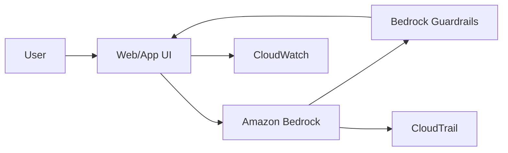

Use when: chatbot does not need private document grounding or external actions.

### Recipe B: RAG knowledge assistant

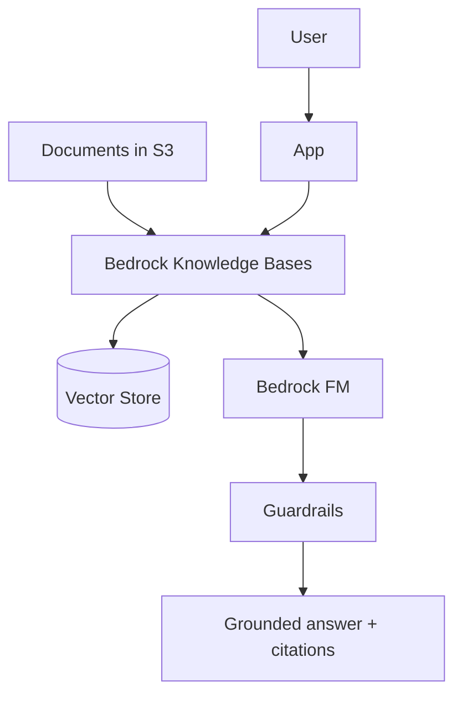

Use when: answers must be grounded in private documents.

### Recipe C: Agent that performs actions

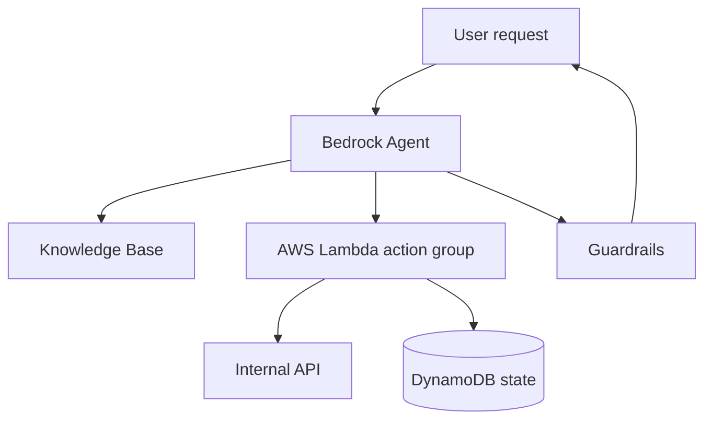

Use when: the AI must not only answer but also do something.

### Recipe D: Custom ML production pipeline

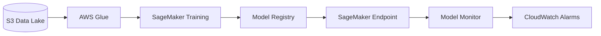

Use when: you train and operate a custom ML model.

### Recipe E: Responsible AI review loop

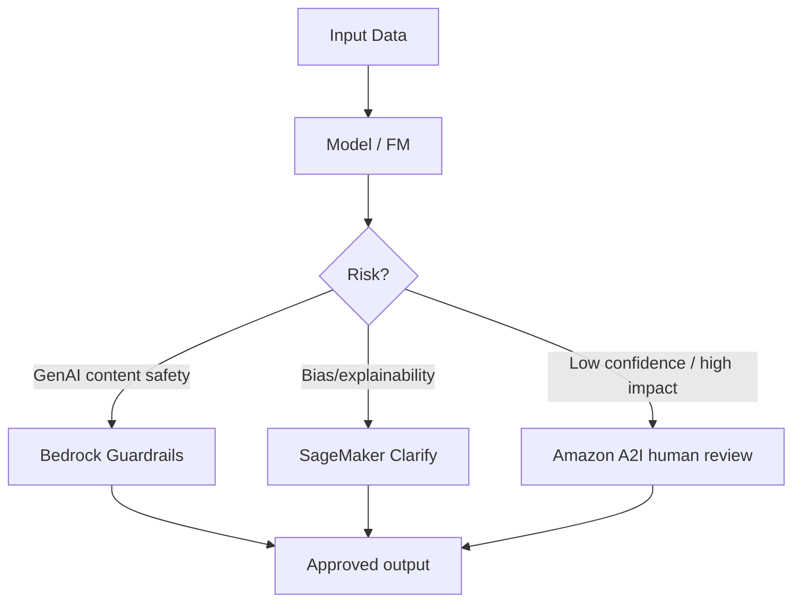

---

## 16. Service Selection Cheat Sheet by Exam Theme

### Cost-effective

Prefer:

1. Managed services over custom infrastructure.
2. Smaller foundation models for simple tasks.
3. Batch processing when real-time is not required.
4. Inferentia for high-volume inference when compatible.
5. Spot instances for SageMaker training where interruption is acceptable.
6. Budgets and Cost Explorer for cost control.

### Quickest to deploy

Prefer:

1. Bedrock over custom model hosting.
2. Bedrock Knowledge Bases over custom RAG.
3. Amazon Q Business over building an enterprise assistant from scratch.
4. SageMaker Canvas/Autopilot over manual ML development.
5. Pre-trained AI services such as Comprehend, Rekognition, Textract, Polly, Transcribe, and Translate.

### Highest control

Prefer:

1. SageMaker for custom ML models.
2. OpenSearch/Aurora pgvector/Neptune for custom retrieval stores.
3. EC2 GPU/ECS/EKS for custom runtime infrastructure.
4. Custom pipelines with Glue, S3, Lambda, and SageMaker.

### Security and compliance

Prefer:

1. IAM for least privilege.
2. KMS for encryption.
3. VPC/PrivateLink for private connectivity.
4. CloudTrail for audit logging.
5. CloudWatch for logs/metrics/alarms.
6. Macie for sensitive data discovery.
7. Artifact and Audit Manager for compliance evidence.
8. Guardrails for GenAI content safety.

---

## 17. Do-Not-Confuse Table

| Easy to confuse | Difference |
|---|---|
| Bedrock vs SageMaker | Bedrock uses managed FMs; SageMaker builds/trains/deploys custom ML models |
| Bedrock Knowledge Bases vs Kendra | Knowledge Bases generates grounded answers; Kendra is enterprise search |
| Bedrock Agents vs Lex | Agents use FMs for reasoning/actions; Lex is structured chatbot intent/slot flow |
| Guardrails vs IAM | Guardrails control model inputs/outputs; IAM controls AWS permissions |
| Guardrails vs Clarify | Guardrails filter GenAI content; Clarify detects bias/explainability in ML |
| Comprehend vs Textract | Comprehend analyzes text meaning; Textract extracts text/structure from documents |
| Rekognition vs Textract | Rekognition analyzes images/videos; Textract extracts document data |
| Polly vs Transcribe | Polly is text-to-speech; Transcribe is speech-to-text |
| Forecast vs Personalize | Forecast predicts time-series values; Personalize recommends items |
| Lookout for Metrics vs CloudWatch | Lookout detects metric anomalies using ML; CloudWatch observes metrics/logs/alarms |
| CloudTrail vs CloudWatch | CloudTrail audits API calls; CloudWatch monitors operational telemetry |
| Macie vs KMS | Macie finds sensitive data; KMS encrypts data |
| Artifact vs Audit Manager | Artifact gives compliance reports; Audit Manager automates audit evidence |
| Trainium vs Inferentia | Trainium is for training; Inferentia is for inference |

---

## 18. Final Memory Hooks

- Bedrock = foundation models.
- SageMaker = custom ML lifecycle.
- Q Business = enterprise assistant.
- Q Developer = coding assistant.
- Knowledge Bases = managed RAG.
- Agents = take actions.
- Guardrails = GenAI safety.
- Clarify = bias/explainability.
- Model Monitor = drift and quality monitoring.
- A2I = human review.
- Comprehend = text meaning.
- Textract = document extraction.
- Rekognition = image/video understanding.
- Polly speaks. Transcribe listens. Translate translates.
- Forecast predicts time. Personalize recommends items.
- Kendra searches enterprise documents.
- OpenSearch/Aurora pgvector/MemoryDB = vector retrieval options.
- IAM permits. KMS encrypts. VPC isolates. CloudTrail audits. CloudWatch monitors. Macie finds sensitive data.
